# Practical Messaging

### Presentation starts ~ 12:02

---

# Practical Messaging
* Demo message driven batch (ServicePulse)
* Demo event driven order system (ServiceInsight)
* Obstacles in message driven systems
* Demo dependant invoice generation system

---

## Message based batch processing (Demo)

--

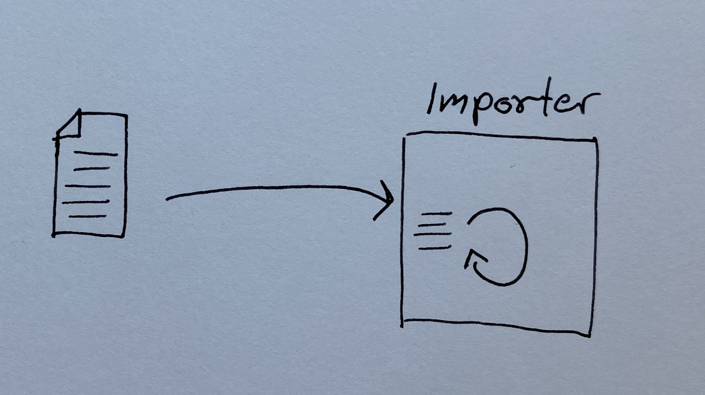

--

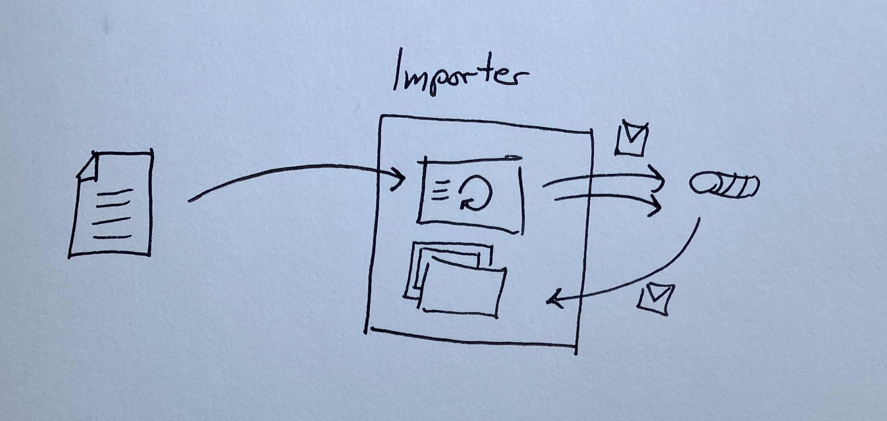

---

## Event driven ordersystem (Demo)

--

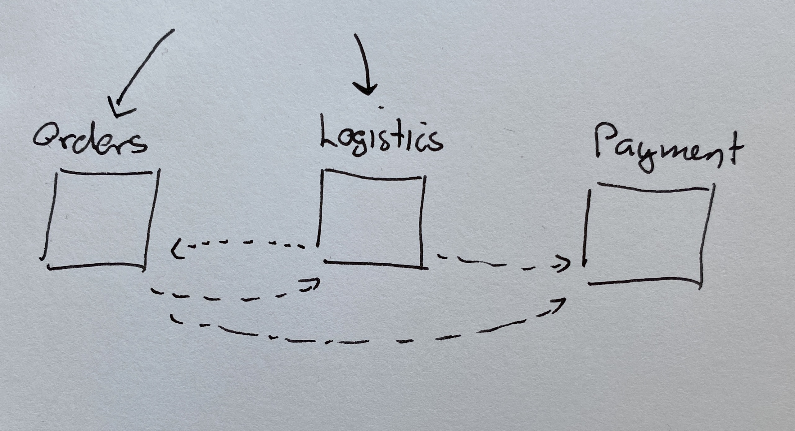

---

## Transport transactions 
### At-least-once delivery

--

### Receiving messages

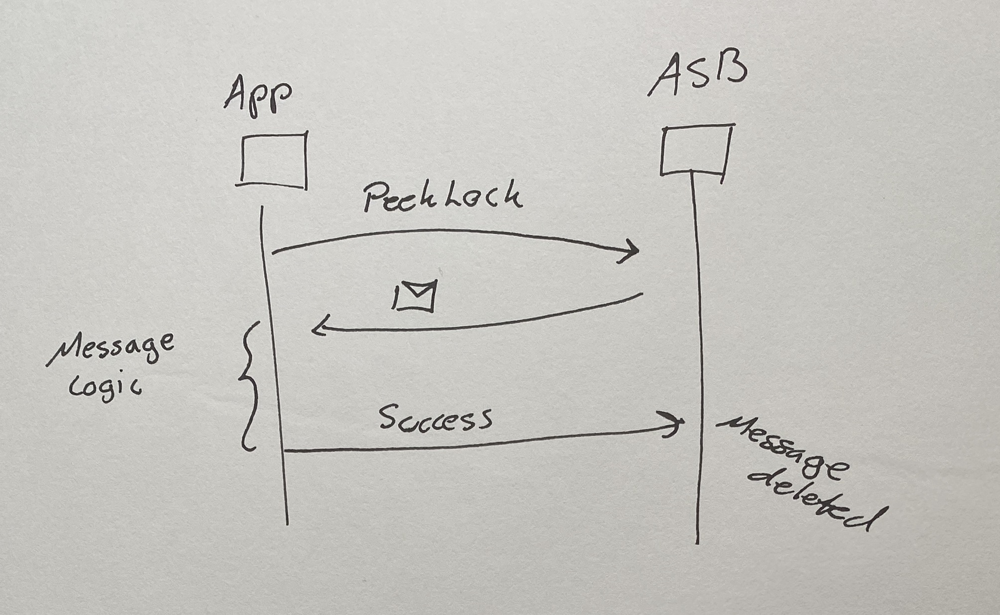

--

Message handler logic will be executed\
 *at-least once* per message on the queue

--

### Sending messages

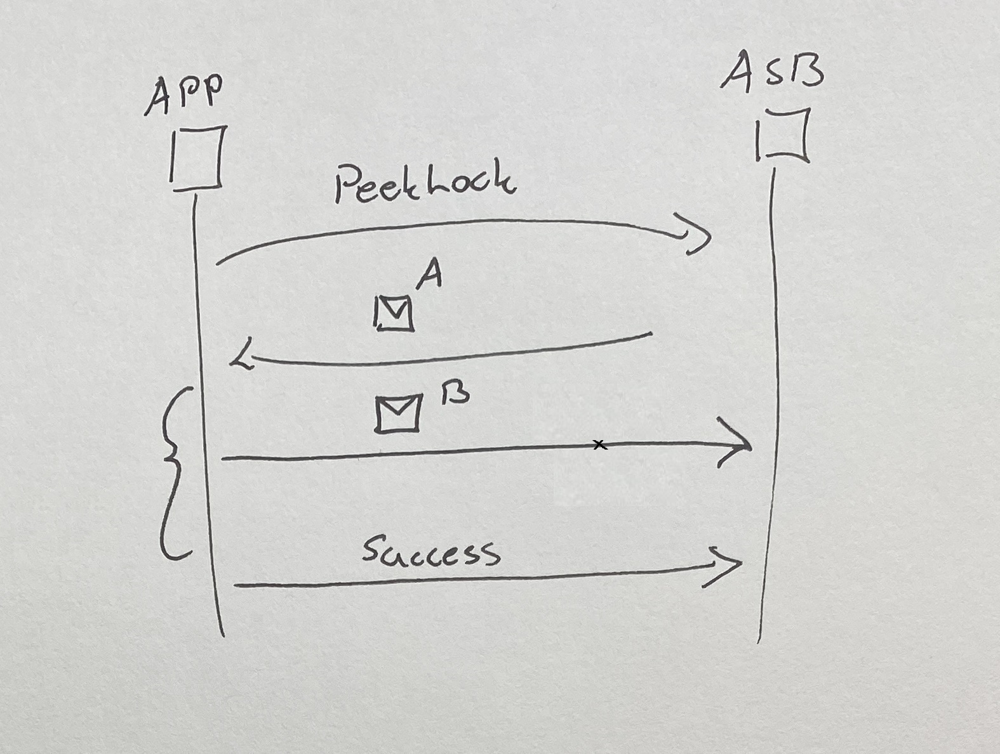

--

Messages can be duplicated when sent to different queues

--

### Atomic operations
* All IO operations must be committed as one
* Fail or complete together

--

#### Forwarding

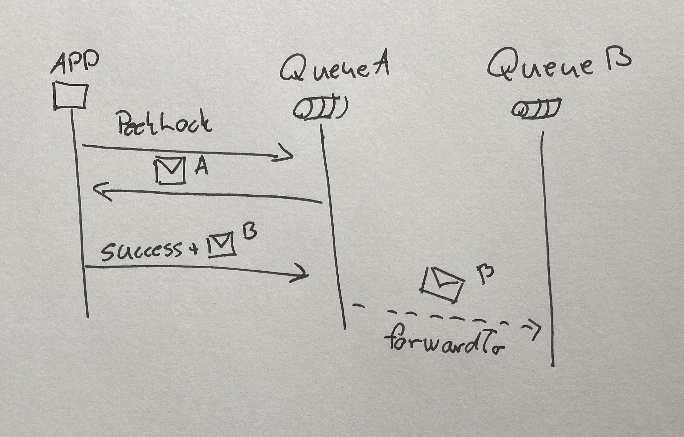

---

### Partial completion

--

 * Operations targeting multiple storage types
 * Not possible to execute atomically
 * E.g. queue + SQL

--

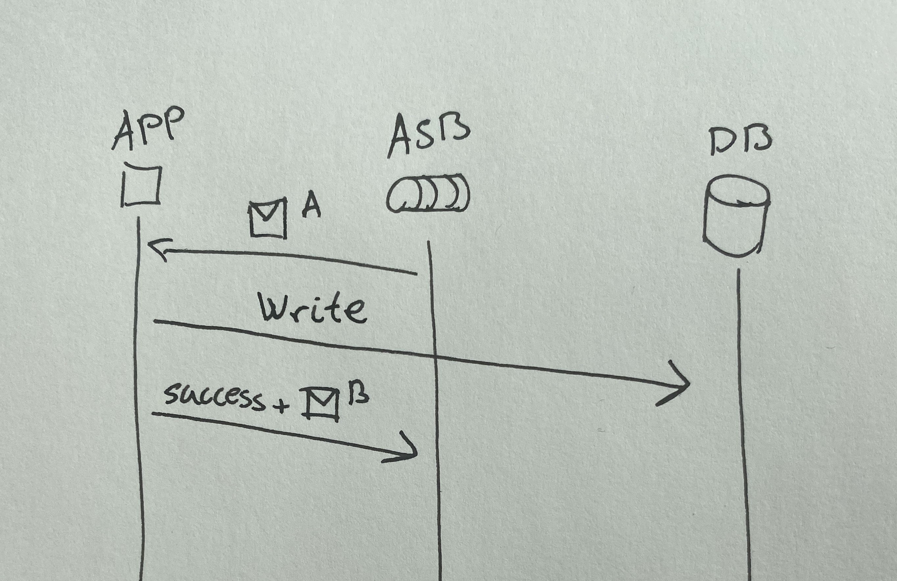

--

Parts of message handler executed before failure,\
logic possibly executed twice

--

#### Outbox

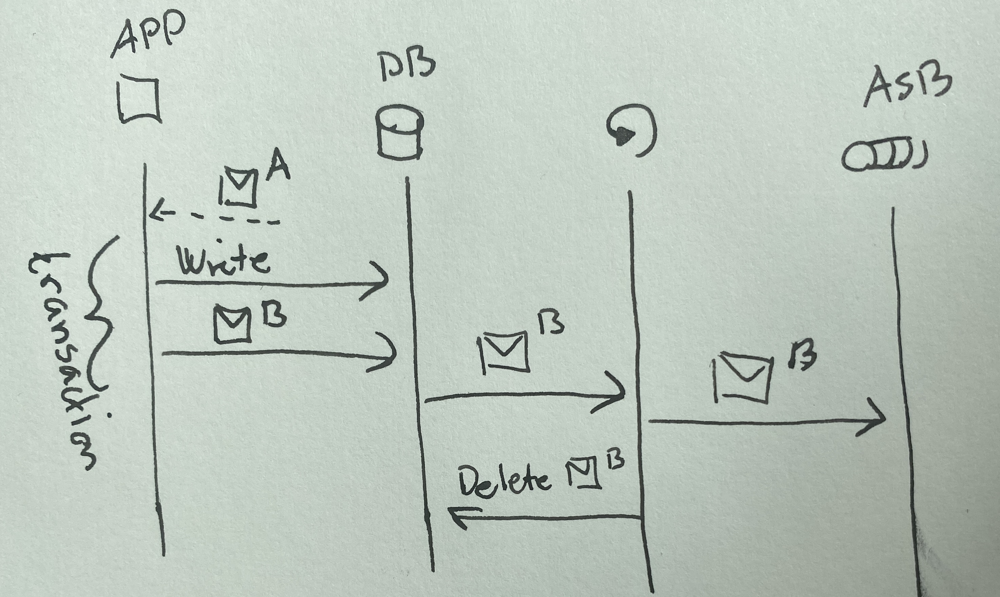

--

Duplicates can still occur!

---

### Idempotency

--

#### Natural idempotency

* TurnLightSwitch
* SwitchOfTheLights

---

#### De-duplication

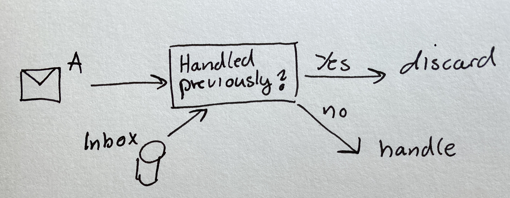

---

### NServiceBus outbox
* Implementation of outbox + de-dup for SQL server
* Ensures exactly-once delivery

--

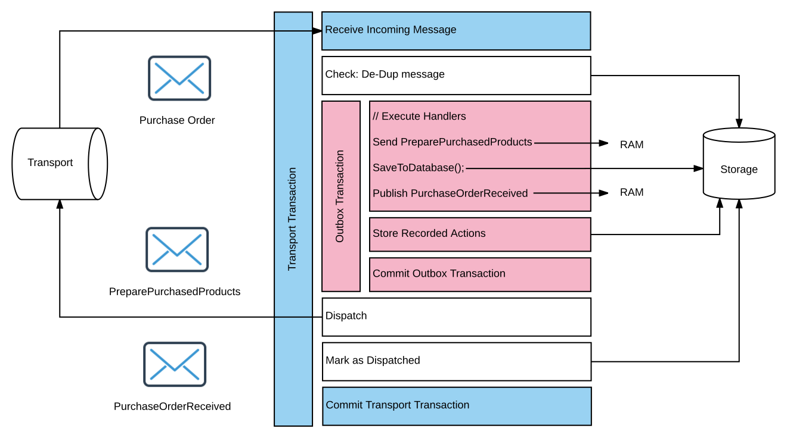

--

### Message ordering
* No guarantee on message order

--

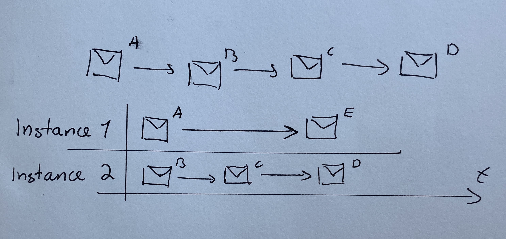

--

* No magic solution
* Never asume ordered message delivery
* Avoid dependant messages

---

## Dependant invoice generation system (Demo)

--

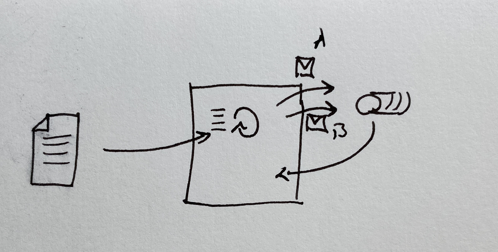

--

---

